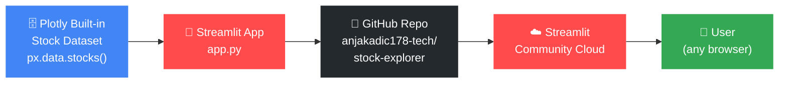
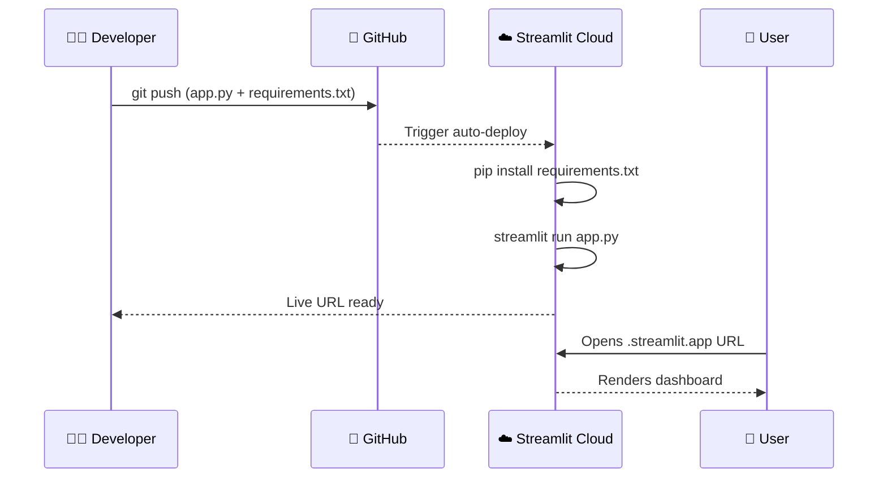
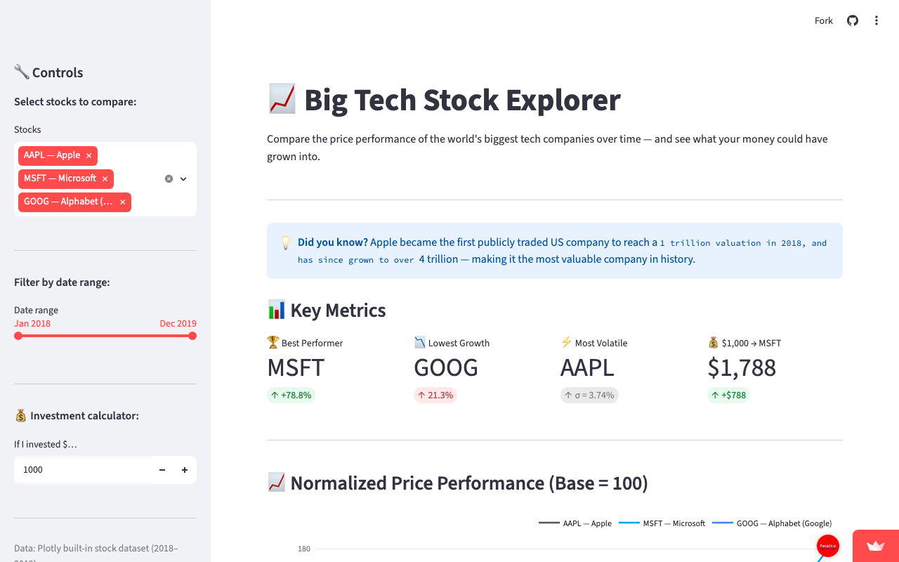

# 📈 Big Tech Stock Explorer

A live, interactive Streamlit dashboard that compares the price performance of the world's biggest tech companies — built as part of the *Ship It & Prove It* university assignment.

🔗 **Live App:** [Add your Streamlit URL here after deployment]

---

## Features

- 📊 **Normalized price chart** — compare stocks fairly from the same starting point
- 🏆 **Best performer metric** — instantly see which stock grew the most
- 📉 **Lowest growth & most volatile** indicators
- 💰 **"What if I invested $X?"** calculator with results table
- 📅 **Date-range slider** — zoom into any period
- 📊 **Bar chart** of total growth per stock
- 💡 **Real-world fact** fetched with the Fetch MCP
- 🧠 **Analyst note** explaining how to read each chart

---

## Tech Stack

| Tool | Purpose |
|---|---|
| Python 3 | Core language |
| Streamlit | Web app framework |
| Plotly Express | Charts + built-in stock dataset |
| pandas | Data manipulation |
| GitHub | Version control + deployment source |
| Streamlit Community Cloud | Live hosting |

---

## How to Run Locally

```bash
# 1. Clone the repo
git clone https://github.com/anjakadic178-tech/stock-explorer
cd stock-explorer

# 2. Install dependencies
pip install -r requirements.txt

# 3. Run the app
streamlit run app.py
```

Then open http://localhost:8501 in your browser.

---

## Architecture Diagram



---

## Deployment Flow



---

## MCP Tools Used

| MCP Pack | What it did |
|---|---|
| **Fetch** 🌐 | Retrieved a real-world fact about Apple from Wikipedia to display in the app |
| **GitHub** 🐙 | Created the public repository and pushed all project files |
| **Mermaid** 🧜 | Generated the architecture and deployment flow diagrams in this README |
| **Playwright** 🎭 | Opened the live app and took a screenshot to prove it works |
| **Context7** 📚 | Provided up-to-date Streamlit documentation while building features |
| **Filesystem** 📁 | Read and managed project files during development |

---

## Screenshot



---

## Reflection

Working on this project showed me how much AI-assisted tooling can accelerate the build cycle. The **Fetch MCP** helped me the most — pulling a real fact from Wikipedia and embedding it directly into the app made the project feel genuinely connected to the real world, not just a toy demo. What surprised me most was how quickly Streamlit turns Python code into a professional-looking web interface — I expected it to require much more front-end work. Beyond the starter template, I added five custom features: a volatility indicator, an investment calculator, a date-range slider, a bar chart, and a best-performer KPI card — turning a simple line chart into a proper analyst dashboard.
