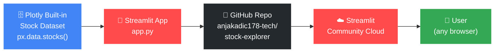
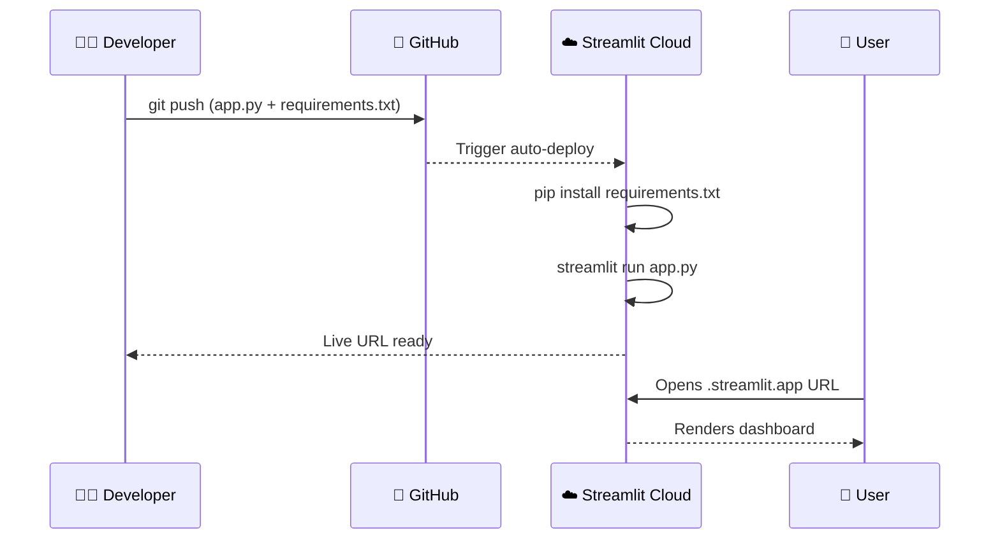

# 📈 Big Tech Stock Explorer

A live, interactive Streamlit dashboard that compares the price performance of the world's biggest tech companies — built as part of the *Ship It & Prove It* university assignment.

🔗 **Live App:** https://stock-explorer-hnymwhwpzlnv8sv6p6bvh8.streamlit.app/

---

## Features

- 📊 **Normalized price chart** — compare stocks fairly from the same starting point
- 🏆 **Best performer metric** — instantly see which stock grew the most
- 📉 **Lowest growth & most volatile** indicators
- 💰 **"What if I invested $X?"** calculator with results table
- 📅 **Date-range slider** — zoom into any period
- 📊 **Bar chart** of total growth per stock
- 💡 **Real-world fact** fetched with the Fetch MCP
- 🧠 **Analyst note** explaining how to read each chart

---

## Tech Stack

| Tool | Purpose |
|---|---|
| Python 3 | Core language |
| Streamlit | Web app framework |
| Plotly Express | Charts + built-in stock dataset |
| pandas | Data manipulation |
| GitHub | Version control + deployment source |
| Streamlit Community Cloud | Live hosting |

---

## How to Run Locally

```bash
# 1. Clone the repo
git clone https://github.com/anjakadic178-tech/stock-explorer
cd stock-explorer

# 2. Install dependencies
pip install -r requirements.txt

# 3. Run the app
streamlit run app.py
```

Then open http://localhost:8501 in your browser.

---

## Architecture Diagram



---

## Deployment Flow



---

## MCP Tools Used

| MCP Pack | What it did |
|---|---|
| **Fetch** 🌐 | Retrieved a real-world fact about Apple from Wikipedia to display in the app |
| **GitHub** 🐙 | Created the public repository and pushed all project files |
| **Mermaid** 🧜 | Generated the architecture and deployment flow diagrams in this README |
| **Playwright** 🎭 | Opened the live app and took a screenshot to prove it works |
| **Context7** 📚 | Provided up-to-date Streamlit documentation while building features |
| **Filesystem** 📁 | Read and managed project files during development |

---

## Screenshot


---

## Reflection

Honestly, the MCP that helped me the most was Fetch — I was expecting to spend ages hunting for an API, but being able to just point Claude at a Wikipedia page and pull a real fact straight into the app made the whole thing feel less like a tutorial and more like actual analyst work. What surprised me was how fast Streamlit turns Python into something that actually looks professional; I came in expecting to fight with layout and CSS for hours, and it just... worked. Beyond the starter template, I added a volatility indicator, a date-range slider, an investment calculator, a bar chart, and a best-performer KPI card — which pushed it from a basic line chart into something I'd genuinely show in a portfolio. Deploying to Streamlit Cloud was also a first for me, and seeing my own URL go live after two minutes was a better payoff than I expected from a half-day assignment.
